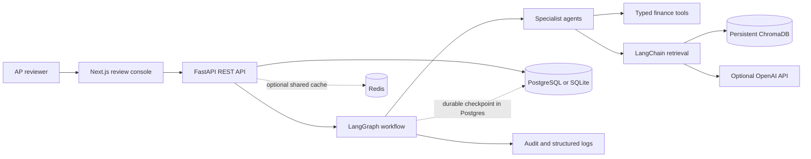
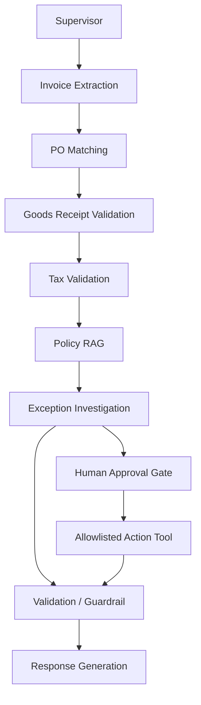
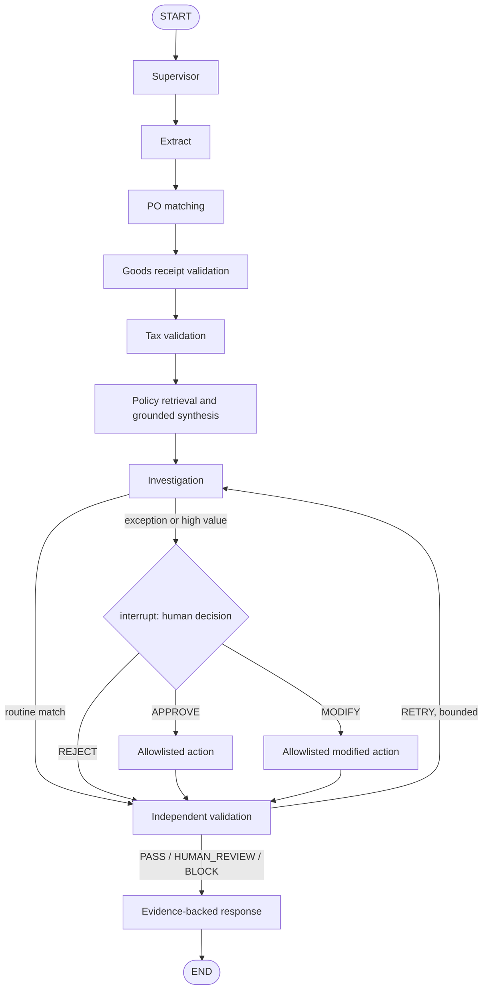
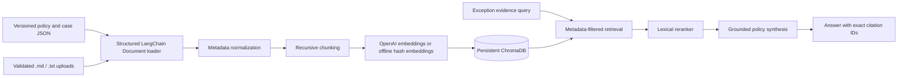

# Supplier Invoice Exception Agent

An evidence-led finance operations workbench that investigates invoice exceptions against purchase orders, goods receipts, tax rules, AP policies, and synthetic historical cases. Specialist LangGraph nodes produce a concise recommendation; consequential actions pause for an explicit human decision. No payment rails are connected.

## 1. Business Problem and Features

Manual accounts-payable review requires reconciling multiple records and policies. This demo automates the evidence gathering and comparison while preserving reviewer control.

- Three-way matching for supplier, PO, currency, price, quantity, and received quantity.
- Synthetic tax arithmetic checks, exception classification, policy/historical RAG, and source citations.
- Approval pause with APPROVE, REJECT, and constrained MODIFY outcomes.
- Structured tool results, audit records, bounded retry routing, request IDs, and JSON logs.
- Local synthetic records: 100 users/suppliers, 203 invoices, 242 purchase orders, 235 goods receipts, 50 historical cases, and 20 policy/case documents.
- Local SQLite and deterministic hash embeddings work without an OpenAI key; OpenAI chat and embeddings are enabled through environment configuration.

## 2. Architecture



### Multi-Agent Architecture



Ten individually registered agent entry points live in `backend/app/agents/`; concise prompt contracts live in `backend/app/prompts/`. Comparison, classification, validation, and action gating are deterministic Python logic. Optional OpenAI structured generation is used to summarize retrieved policy passages; the model cannot authorize tools.

### LangGraph Workflow and Approval



The retry count is bounded by `MAX_WORKFLOW_RETRIES`. SQLite uses LangGraph `MemorySaver` for local development. With PostgreSQL, the API uses `PostgresSaver`, so an interrupted approval is checkpointed durably. The example actions only write synthetic tool outcomes; replace them with an authorized ERP adapter before real use.

### RAG Architecture



Ingestion is an explicit command, never an application-startup side effect. Retrieved text is treated as untrusted evidence and cannot override system instructions. Switching embedding providers requires re-ingestion into a fresh Chroma collection because vector dimensions differ.

## 3. Agent Responsibilities

| Agent | Responsibility |
| --- | --- |
| Supervisor | Sets investigation intent and carries the invoice identifier into the workflow. |
| Invoice Extraction | Loads and validates structured synthetic invoice data; leaves PDF/OCR adapters for later. |
| PO Matching | Compares supplier, PO, price, currency, and ordered quantity. |
| Goods Receipt Validation | Compares billed units with received quantity and identifies missing receipts. |
| Tax Validation | Applies the configured synthetic 8% arithmetic rule and rounding tolerance. |
| Policy RAG | Retrieves metadata-bearing policy and case passages and returns citations. |
| Exception Investigation | Combines record and policy evidence into a Pydantic decision summary. |
| Approval | Uses LangGraph `interrupt()` to stop and await a reviewer decision. |
| Validation / Guardrail | Checks evidence, citations, confidence, tool outcomes, and action authorization. |
| Response Generation | Reports facts, evidence, recommendation, validation, approval, and confirmed outcomes. |

No chain-of-thought is stored or returned. LLM output is not a substitute for a tool result or approval record.

## 4. Technology and Repository Layout

Frontend: Next.js App Router, React, TypeScript, Tailwind CSS, Lucide icons. Backend: FastAPI, Pydantic, SQLAlchemy. Agent/RAG: LangGraph, LangChain, OpenAI-compatible chat/embeddings, ChromaDB. Persistence: PostgreSQL in Compose, SQLite locally; Redis is provisioned for a shared cache/rate-limit extension. Tests: Pytest.

```text
frontend/                 Next.js AP investigation desk
backend/app/agents/        Ten specialist graph entry points
backend/app/graph/         Typed state, specialist nodes, conditional workflow
backend/app/rag/           Loaders, chunking, embeddings, Chroma, retrieval
backend/app/tools/         Typed finance tool contracts and synthetic adapters
backend/app/models/        SQLAlchemy database and required tables
backend/app/api/           FastAPI endpoints, lifecycle, approval resume
backend/app/prompts/       Prompt contracts by specialist
backend/tests/             Graph safety and API integration tests
backend/scripts/           Seeding, ingestion, and interactive demo
data/knowledge_base/       Twenty synthetic policy and case documents
evaluation/                Forty-case dataset and deterministic evaluator
docker-compose.yml         PostgreSQL, Redis, backend, frontend
```

SQLAlchemy tables cover users, sessions, messages, invoices, purchase orders, goods receipts, workflows, agent runs, tool calls, documents, document chunks, approvals, audit logs, evaluations, and historical exceptions.

## 5. Local Installation

Prerequisites: Python 3.11+, Node.js 20+, npm, and (for Docker) Docker Compose v2.

```bash
cd supplier-invoice-exception-agent
cp .env.example .env
python -m venv .venv
source .venv/bin/activate
python -m pip install -r backend/requirements.txt
```

Put `OPENAI_API_KEY` in `.env` to use the configured OpenAI chat model and embeddings. Without it, offline deterministic embeddings and policy responses are used. Never commit `.env`.

### Database and RAG Setup

```bash
python scripts/seed_data.py
python scripts/ingest.py
```

The API creates tables on startup; `seed_data.py` fills the synthetic records idempotently. `ingest.py` loads, chunks, embeds, and persists knowledge documents to Chroma. Re-run ingestion after changing documents or the embedding provider.

### Run Backend and Frontend

In one terminal, from `backend/`:

```bash
uvicorn app.api.main:app --reload --port 8000
```

In another terminal, from `frontend/`:

```bash
npm ci
npm run dev
```

Open `http://localhost:3000`. API docs are at `http://localhost:8000/docs`. To run a terminal approval demo: `python scripts/run_demo.py` from the project root.

## 6. Environment Variables

| Variable | Purpose | Default |
| --- | --- | --- |
| `OPENAI_API_KEY` | Enables OpenAI chat and embedding integrations | unset (offline mode) |
| `OPENAI_MODEL` | Grounded policy synthesis model | `gpt-4o-mini` |
| `OPENAI_EMBEDDING_MODEL` | OpenAI embedding model | `text-embedding-3-small` |
| `DATABASE_URL` | SQLAlchemy database URL | `sqlite:///./supplier_agent.db` |
| `CHROMA_PERSIST_DIRECTORY` | Persistent local Chroma data path | `./.chroma` |
| `LANGSMITH_TRACING` / `LANGSMITH_API_KEY` | LangSmith tracing configuration | disabled / unset |
| `CORS_ORIGINS` | Comma-separated allowed browser origins | `http://localhost:3000` |
| `MAX_WORKFLOW_RETRIES` | Bounded investigation retry count | `2` |
| `UPLOAD_MAX_BYTES` | Maximum accepted policy text upload | `10000000` |
| `NEXT_PUBLIC_API_URL` | Browser-visible API base URL | `http://localhost:8000/api` |

## 7. REST API

| Method | Endpoint | Purpose |
| --- | --- | --- |
| `POST` | `/api/chat` | Start an investigation from a message containing an invoice ID. |
| `POST` | `/api/agent/run` | Start the multi-agent workflow by invoice ID. |
| `POST` | `/api/documents/upload` | Upload validated `.md` or `.txt` policy source. |
| `POST` | `/api/documents/ingest` | Chunk and index source documents. |
| `GET` | `/api/sessions/{session_id}` | Read session workflow summaries. |
| `GET` | `/api/workflows/{workflow_id}` | Read workflow state and audit events. |
| `POST` | `/api/approval/{workflow_id}` | Resume an awaiting workflow with APPROVE, REJECT, or MODIFY. |
| `GET` | `/api/health` | Check service and database availability. |
| `GET` | `/api/metrics` | Read local workflow, approval, and retrieval counts. |

Example request:

```bash
curl -X POST http://localhost:8000/api/agent/run \
  -H 'Content-Type: application/json' \
  -d '{"invoice_id":"INV-1002","user_id":"demo-user","query":"Investigate quantity variance"}'
```

Expected initial response (IDs and evidence excerpts are illustrative):

```json
{
  "workflow_id": "<generated UUID>",
  "status": "awaiting_approval",
  "current_stage": "Human Approval",
  "pending_approval": true,
  "investigation_result": {
    "issue_type": "quantity_mismatch",
    "recommended_action": "place_invoice_on_hold",
    "requires_human_review": true
  },
  "tool_results": []
}
```

After reviewing evidence, submit `{"decision":"APPROVE","reviewer":"ap.reviewer","rationale":"Verified receipt"}` to `/api/approval/{workflow_id}`. A hold is reported only if the allowlisted tool returns success. A high-value but otherwise matched invoice requires review and does not implicitly become a hold.

## 8. Tests and Evaluation

```bash
cd backend && python -m pytest -q
cd ..
python scripts/seed_data.py
python scripts/ingest.py
PYTHONPATH=backend python evaluation/evaluate.py
```

The evaluation dataset has 40 cases: 10 normal and five each for ambiguous, missing information, tool failure, prompt injection, policy conflict, and human approval. The local evaluator measures escalation agreement, evidence coverage, and safe pauses. Broader metrics such as blinded retrieval relevance, usefulness, latency distributions, and real-world hallucination rate require labeled production traces; the script does not claim to establish them.

## 9. Docker and Deployment

From this directory:

```bash
docker compose up --build
```

The stack starts PostgreSQL, Redis, FastAPI, and Next.js. The backend uses Postgres-backed LangGraph checkpointing; Chroma is embedded and persisted in a named volume. Demo database credentials in Compose are for local use only. For Vercel, set the frontend root directory to `frontend` and configure `NEXT_PUBLIC_API_URL` to the deployed backend origin. Deploy FastAPI and PostgreSQL to AWS, Azure, Render, Railway, or an equivalent managed platform; persist Chroma or move it to a managed vector service and configure HTTPS/CORS, secrets, and identity before public exposure.

GitHub upload from the parent workspace:

```bash
git add supplier-invoice-exception-agent README.md
git commit -m "Build supplier invoice exception agent"
git remote add origin https://github.com/<owner>/<repository>.git
git push -u origin main
```

For Codespaces, commit the project, open the repository in Codespaces, copy `.env.example` to `.env`, then run `docker compose up --build` or follow the local setup. Add secrets through Codespaces Secrets, not checked-in files.

## 10. Security, Limitations, and Next Steps

- API CORS, bounded upload size/type, request IDs, explicit tool schemas, masked-data policy, and untrusted-document prompt boundaries are included. Authentication is an integration boundary, not enabled authorization; protect the API with an identity provider and reviewer-role checks before deployment.
- Redis is included in Compose but is not required by the local workflow; wire it to a shared rate limiter/cache for multi-replica deployments.
- The invoice and action adapters are synthetic. No PDF/image OCR, ERP connector, payment release, refund, or real hold service is connected. The 8% tax check applies only to seeded demo records.
- The workflow logic is deterministic for auditability; OpenAI is optional and currently supports grounded policy synthesis and embedding generation rather than deciding or executing actions.
- Production rollout should add identity/authorization, database migrations, resilient external tool timeouts, distributed idempotency, reviewer dual-control enforcement, OCR, richer agent-run telemetry, and a labeled evaluation program.

## 11. GitHub and Codespaces

`.gitignore` excludes local secrets, Python environments, SQLite/Chroma state, uploads, and Next.js build products. GitHub Actions can run the pytest and frontend build checks; use a PostgreSQL service in CI to cover durable checkpoint resume.